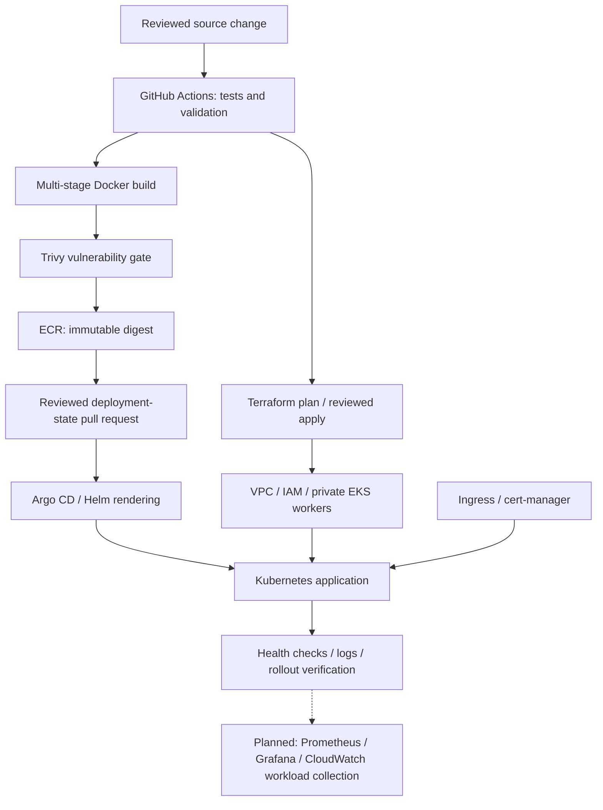

# Nafees Ur Rehman
### AWS DevOps & Cloud Infrastructure Engineer

`nafees@platform:~$ cat engineering-focus.txt`

Building production-oriented AWS infrastructure with Terraform, Kubernetes, and reviewed delivery workflows. My portfolio connects infrastructure provisioning, CI/CD, GitOps, and Python/Bash automation with least-privilege access and reproducible operations. The repositories distinguish implemented code from cloud deployment evidence.

*Illustrative commands, not a live terminal or deployment history.*

## Engineering principles

| Area | Principle |
| --- | --- |
| Infrastructure | Declarative, modular, versioned |
| Deployments | Automated, immutable, verified |
| Security | Least privilege and short-lived credentials |
| Changes | Reviewed and traceable |
| Environments | Separate state and configuration |
| Operations | Observable behavior and actionable runbooks |
| Recovery | Designed and tested before claiming readiness |

## Platform workflow

**Architect → Provision → Build → Test → Scan → Deploy → Observe → Operate**

Terraform owns the cloud foundation and platform add-ons. Argo CD owns application deployment state. Planned observability integrations are shown explicitly.

## Technology focus

| Domain | Technologies |
| --- | --- |
| Cloud & IaC |           |
| Containers & orchestration |     |
| CI/CD & DevSecOps |     |
| Automation & integration |    |
| Observability |    |

The matrix describes engineering focus; it is not a claim of production experience with every technology.

## Featured engineering projects

### Modular AWS EKS platform

[Repository](https://github.com/expertnafees-hub/aws-eks-terraform-platform)

| Dimension | Implementation and intent |
| --- | --- |
| Problem | Reproduce Kubernetes infrastructure with explicit environment boundaries. |
| Architecture | Multi-AZ VPC, private managed nodes, private EKS API, IAM/IRSA, and Helm platform add-ons. |
| Decisions | Separate foundation/add-on states; reusable VPC, IAM, security, EKS, and add-on modules. |
| Security | Restricted API CIDRs, scoped controller identities, encrypted/versioned state bootstrap, and certificate automation. |
| Automation | Terraform formatting/schema checks and IaC scanning workflow. |
| Reliability | Two-node baseline, controlled node updates, separate state, and documented teardown/recovery. |
| Stack | AWS, Terraform, EKS, Helm, Traefik, cert-manager. |
| Status | Infrastructure code implemented; AWS provisioning and operational validation pending. |

Related baseline: [AWS VPC Foundation](https://github.com/expertnafees-hub/aws-terraform-vpc-foundation), a deliberately small public-subnet networking project.

### GitOps application delivery

[Application and CI](https://github.com/expertnafees-hub/gitops-core-api) · [Deployment configuration](https://github.com/expertnafees-hub/gitops-platform-config)

| Dimension | Implementation and intent |
| --- | --- |
| Problem | Trace a reviewed source change to an immutable Kubernetes release. |
| Architecture | Flask/Gunicorn → Docker → Trivy → ECR → GitOps pull request → Argo CD. |
| Decisions | Separate application/deployment repositories; digest promotion; explicit release dispatch. |
| Security | Non-root read-only runtime, dropped capabilities, short-lived AWS identity, and scoped GitHub App promotion. |
| Automation | Application tests, image gate, container smoke test, chart validation, and promotion script. |
| Reliability | Startup/readiness/liveness probes, bounded rolling updates, disruption budget, and Git-based rollback procedure. |
| Stack | Python, Docker, GitHub Actions, Trivy, ECR, Helm, Argo CD, Kubernetes. |
| Status | Application and delivery code implemented; AWS/ECR/Argo CD integration requires environment setup. |

## GitHub analytics

Public activity and repository languages

These [third-party cards](https://github.com/anuraghazra/github-readme-stats) are best-effort and can be rate-limited or unavailable. Reliable hosting requires separate configuration. Language distribution describes repository contents, not proficiency.

## Contribution activity

Contribution visualization

<picture>
  <source media="(prefers-color-scheme: dark)" srcset="https://raw.githubusercontent.com/expertnafees-hub/expertnafees-hub/output/github-contribution-grid-snake-dark.svg">
  <source media="(prefers-color-scheme: light)" srcset="https://raw.githubusercontent.com/expertnafees-hub/expertnafees-hub/output/github-contribution-grid-snake.svg">
  
</picture>

Generated by the repository workflow; available after its first successful run.

## Contact & collaboration

I welcome discussion of AWS architecture, Terraform module boundaries, Kubernetes delivery, and infrastructure automation.

[GitHub](https://github.com/expertnafees-hub) · [Public repositories](https://github.com/expertnafees-hub?tab=repositories)

Use the relevant project's issue tracker for reproducible problems or proposed improvements.
